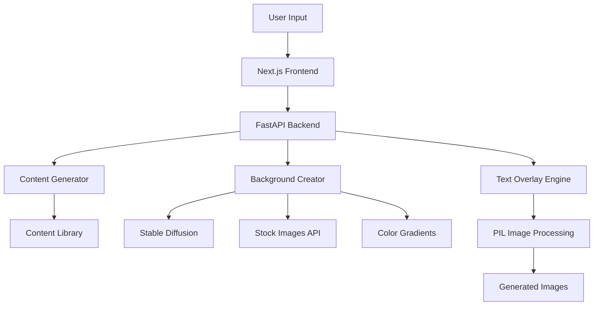

# 🎬 Faceless Video Automation Tool

> A full-stack web application for generating professional social media listicles without showing your face. Perfect for creating engaging content for YouTube, TikTok, and Instagram.

[](#demo)
[](#tech-stack)
[](#license)

## 🚀 Overview

This project solves the common challenge of creating engaging social media content without appearing on camera. It automatically generates professional-looking listicles (swipeable image carousels) from simple topic inputs, complete with relevant content, beautiful backgrounds, and proper formatting for different social platforms.

### ✨ Key Features

- **🎯 Smart Content Generation**: AI-powered content matching for 7+ topic categories
- **📱 Multi-Platform Support**: Optimized for YouTube (1920x1080) and TikTok (1080x1920)
- **🎨 Multiple Background Options**: Color gradients, stock images, and AI-generated backgrounds
- **⚡ Real-Time Preview**: Instant image preview without downloads
- **📦 Easy Export**: Individual images or complete ZIP downloads
- **🔄 Regeneration**: Quick content refresh with one click

## 🎯 How It Works

1. **Enter a Topic** - Type any subject like "productivity tips" or "travel hacks"
2. **Choose Format** - Select landscape (YouTube) or portrait (TikTok/Instagram)
3. **Pick Background** - Color gradients, stock images, or AI-generated
4. **Generate & Download** - Get professional listicle images ready for social media

The app automatically matches your topic to relevant, actionable content and creates visually appealing slides with proper text formatting and professional layouts.

## 🛠️ Tech Stack

### Backend
- **FastAPI** - High-performance Python API framework
- **Stable Diffusion** - AI image generation via Hugging Face diffusers
- **PIL (Pillow)** - Advanced image processing and text overlay
- **PyTorch** - ML model inference optimized for M2 Mac

### Frontend  
- **Next.js 14** - React framework with TypeScript
- **Axios** - HTTP client for API communication
- **Modern CSS** - Responsive design with gradients and animations

### AI & Content
- **Pre-built Content Library** - 8 topic categories with 40+ pieces of content
- **Smart Topic Matching** - Keyword-based content selection
- **Dynamic Text Generation** - Contextual titles and descriptions

## 🚀 Quick Start

### Prerequisites
- Python 3.8+ with pip
- Node.js 18+ with npm
- 8GB+ RAM (16GB recommended for AI features)

### Installation

1. **Clone the repository**
   ```bash
   git clone https://github.com/NelsonSpencer/faceless-video-automation.git
   cd faceless-video-automation
   ```

2. **Set up Python backend**
   ```bash
   python -m venv venv
   source venv/bin/activate  # On Windows: venv\Scripts\activate
   pip install -r requirements.txt
   ```

3. **Set up frontend**
   ```bash
   cd frontend
   npm install
   ```

4. **Start the application**
   ```bash
   # Terminal 1: Start API (from project root)
   source venv/bin/activate
   cd api
   python main.py
   
   # Terminal 2: Start frontend (from project root)
   cd frontend
   npm run dev
   ```

5. **Open your browser**
   - Frontend: http://localhost:3000
   - API Docs: http://localhost:8000/docs

## 💡 Usage Examples

### Basic Usage
```typescript
// Simple topic input
"Top 5 Marketing Strategies"
"Best Travel Hacks"
"Productivity Tips for Remote Work"
```

### Advanced Options
```typescript
{
  topic: "Top 5 Fitness Tips",
  format_type: "portrait",     // "landscape" | "portrait"
  background_type: "stock",    // "color" | "ai" | "stock" 
  num_slides: 5               // 3-8 slides
}
```

### Supported Content Categories
- 🎯 **Productivity** - Time management, workflows, efficiency
- 📈 **Marketing** - Social media, sales, branding strategies  
- 💪 **Fitness** - Workouts, nutrition, wellness tips
- 💰 **Finance** - Saving, investing, money management
- ✈️ **Travel** - Planning, budgeting, safety advice
- 🧠 **Learning** - Study techniques, skill development
- 👨‍🍳 **Cooking** - Techniques, kitchen tips, organization
- 🏥 **Health** - Wellness, habits, self-care

## 🏗️ Architecture



### Key Components

- **Content Generator**: Smart matching of user topics to relevant advice
- **Background Creator**: Multiple background generation strategies
- **Text Overlay Engine**: Advanced typography with automatic sizing and wrapping
- **Image Processing Pipeline**: High-quality output optimization

## 📋 Project Structure

```
faceless-video-automation/
├── api/
│   └── main.py                 # FastAPI backend application
├── frontend/
│   ├── src/app/               # Next.js application pages
│   ├── package.json           # Frontend dependencies
│   └── next.config.js         # Next.js configuration
├── stable-diffusion/
│   └── scripts/               # Image generation scripts
├── CLAUDE.md                  # Development documentation
├── PRD.md                     # Product Requirements Document
└── requirements.txt           # Python dependencies
```

## 🎯 Roadmap

### Phase 2: Enhanced Content (Q2 2024)
- [ ] AI-powered content generation with GPT integration
- [ ] Custom brand templates and color schemes
- [ ] Advanced typography options

### Phase 3: Video Generation (Q3 2024)  
- [ ] Automatic slideshow video compilation
- [ ] Text-to-speech voiceover integration
- [ ] Background music and transitions

### Phase 4: Platform Integration (Q4 2024)
- [ ] Direct social media posting
- [ ] Analytics and performance tracking
- [ ] Collaboration features

## 🤝 Contributing

This is a personal project, but feedback and suggestions are welcome!

1. Fork the repository
2. Create a feature branch (`git checkout -b feature/amazing-feature`)
3. Commit your changes (`git commit -m 'Add amazing feature'`)
4. Push to the branch (`git push origin feature/amazing-feature`)
5. Open a Pull Request

## 📄 License

This project is licensed under the MIT License - see the [LICENSE](LICENSE) file for details.

## 🙏 Acknowledgments

- **Hugging Face** for the excellent diffusers library
- **Unsplash** for stock image API
- **Vercel** for Next.js framework
- **FastAPI** team for the amazing Python framework

## 📞 Contact

**Nelson Spencer** - [@nelsonspencer](https://github.com/nelsonspencer)

Project Link: [https://github.com/NelsonSpencer/faceless-video-automation](https://github.com/NelsonSpencer/faceless-video-automation)

---

⭐ **If this project helped you create content, please consider giving it a star!**